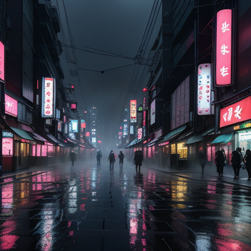
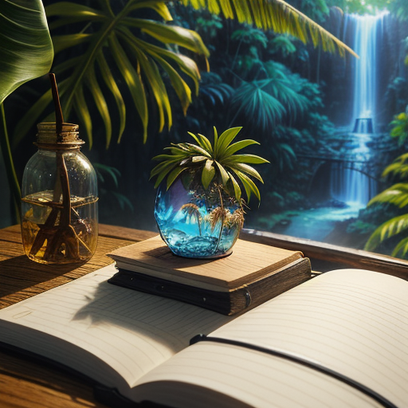
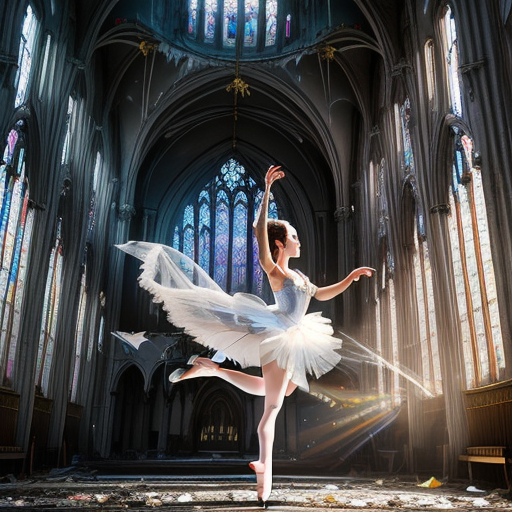

# EasyGenerate

**Generate AI images with one python file!**

<table align="center">
<tr>
<td align="center"><br><sub>Rainy neon Tokyo</sub></td>
<td align="center"><br><sub>Island in a bottle</sub></td>
<td align="center"><br><sub>Cathedral ballerina</sub></td>
<td align="center"><br><sub>Product poster</sub></td>
</tr>
</table>

<p align="center"><sub>All four generated on a laptop CPU with the default settings — see <a href="Image_Tests">Image_Tests/</a>.</sub></p>

<details>
<summary><b>Prompts used for these samples</b> (click to expand)</summary>

<br>

**1 · Rainy neon Tokyo**

> A futuristic Tokyo street at night during heavy rain, neon signs reflected in puddles, pedestrians with transparent umbrellas, flying drones overhead, dense atmospheric fog, cyberpunk aesthetic, extremely detailed, wide-angle composition.

**2 · Island in a bottle**

> A glass bottle containing a miniature tropical island with palm trees, a waterfall, tiny birds, and glowing fireflies, sitting on a wooden desk beside an open notebook, magical realism, macro photography, soft window light.

**3 · Cathedral ballerina**

> A ballerina performing mid-air inside an abandoned cathedral with shattered stained-glass windows, dramatic volumetric light rays, flowing fabric, realistic anatomy and hands, dynamic motion blur, high-detail cinematic composition.

**4 · Product poster**

> A clean minimalist product poster for a fictional smartwatch called Aster One, centered on a white background, premium Apple-style advertising design, with the headline Aster One and the tagline Time, refined rendered as perfectly readable typography.

All four used the built-in default negative prompt. Note that SD 1.5 cannot reliably render text — the poster prompt asked for readable lettering and got shapes instead.

</details>

Single-file, CPU-only image tools. Run one, type a prompt, get a PNG. No GPU, no web UI, no API keys — just Python and patience.

There are two scripts, and they are **not** the same thing under the hood:

| Script | Job | Model |
|---|---|---|
| [`generateimage.py`](generateimage.py) | **Text → image.** Describe something, get a new picture. | [Lykon/dreamshaper-8](https://huggingface.co/Lykon/dreamshaper-8) (an SD 1.5 fine-tune) |
| [`EDIT-PHOTO/editimage.py`](EDIT-PHOTO/editimage.py) | **Image + instruction → image.** Point it at a picture and tell it what to change. | [timbrooks/instruct-pix2pix](https://huggingface.co/timbrooks/instruct-pix2pix) |

Both use [Hugging Face Diffusers](https://github.com/huggingface/diffusers), and both are separate downloads — using the editor does not reuse the generator's weights.

---

## Requirements

- Python 3.9+
- ~8 GB RAM free (models are loaded in `float32`)
- ~5 GB disk per model, so ~10 GB if you use both (downloaded once, cached)

## Install

```bash
git clone https://github.com/lllons/EasyGenerate.git
cd EasyGenerate

python -m venv .venv
# Windows
.venv\Scripts\activate
# macOS / Linux
source .venv/bin/activate

pip install torch diffusers transformers accelerate safetensors pillow
```

> On Linux, plain `pip install torch` pulls the ~2.5 GB CUDA build. For a much smaller CPU-only wheel:
> `pip install torch --index-url https://download.pytorch.org/whl/cpu`

One install covers both scripts — the editor needs no extra packages.

## Generating images

```bash
python generateimage.py
```

The first run downloads the model (a few GB) into your Hugging Face cache — subsequent runs start straight away.

You'll be asked for two things:

1. **Prompt** — what you want to see.
2. **Negative prompt** — what you *don't* want. Press Enter to accept the default (`blurry, low quality, distorted, extra limbs, bad anatomy, text, watermark`).

Output is saved next to the script as `phto1.png`, `phto2.png`, and so on — existing files are never overwritten.

### Example

```
Enter your PROMPT:
> a lighthouse on a rocky coast at dusk, dramatic clouds, cinematic lighting

Enter your NEGATIVE PROMPT (leave blank for default):
>
```

Expect roughly **1–3 minutes** per image on a modern laptop CPU at the default settings.

### Tinkering

All the knobs live in section 3 of `generateimage.py`. Edit the constants and re-run.

| Setting | Default | What it does |
|---|---|---|
| `WIDTH` / `HEIGHT` | `512` | Output size. Must be multiples of 8. SD 1.5 is trained at 512×512 — going much higher tends to produce duplicated limbs and heads, and costs a lot more CPU time. |
| `STEPS` | `12` | Denoising steps. More steps = cleaner detail, linearly slower. 12 is fast-and-rough; 20–30 is the usual sweet spot. |
| `GUIDANCE_SCALE` | `7.5` | How strictly the model obeys the prompt. Low (3–5) is loose and creative, high (10–15) is literal but can look overcooked. |
| `SEED` | `16` | Locks randomness so the same prompt gives the same image. Set to `-1` for a different result every run. |
| `OUTPUT_PREFIX` | `"phto"` | Filename prefix for saved images. |

**Reproducibility tip:** keep `SEED` fixed while you iterate on wording, so you can tell whether a change came from your prompt or just from a new roll of the dice. Switch to `-1` once you're happy and want variations.

---

## Editing images — `EDIT-PHOTO/`

Same one-file, no-GPU deal, but starting from a picture you already have. This one runs **InstructPix2Pix** ([`timbrooks/instruct-pix2pix`](https://huggingface.co/timbrooks/instruct-pix2pix)), a different model to the generator, so the first edit triggers its own multi-gigabyte download.

The important difference is what you type. InstructPix2Pix takes an **instruction**, not a description:

| | |
|---|---|
| ✅ | `Make it snow` · `Turn the sky purple` · `Give him a leather jacket` · `Make it look like a watercolour painting` |
| ❌ | `a snowy street` · `a purple sky at dusk, cinematic lighting` |

Describing the scene the way you would for `generateimage.py` will confuse it. Tell it what to *do*.

### Run

```bash
cd EDIT-PHOTO
python editimage.py
```

Before running, put the image you want to edit in the `EDIT-PHOTO/` folder and name it **`input.png`** — the script doesn't ask for a path. (To use a different file, change the `INPUT_IMAGE` constant in section 3.)

You'll be asked for two things:

1. **Edit instruction** — the change you want made.
2. **Negative prompt** — same default as the generator; press Enter to accept it.

Results are saved next to the script as `edit1.png`, `edit2.png`, and so on. As with the generator, existing files are never overwritten.

```
Enter your EDIT INSTRUCTION:
> make it winter, cover everything in fresh snow

Enter your NEGATIVE PROMPT (leave blank for default):
>
```

### Tinkering

Section 3 of `editimage.py`, same as the generator — but with an extra dial and a couple of different defaults.

| Setting | Default | What it does |
|---|---|---|
| `INPUT_IMAGE` | `"input.png"` | The source file, relative to the script. Change this instead of renaming your photos every time. |
| `WIDTH` / `HEIGHT` | `512` | The input is resized to this before editing, and the output comes back at the same size. Multiples of 8 only. InstructPix2Pix has no separate size argument. |
| `STEPS` | `5` | Deliberately low so you get *something* back quickly on CPU. It looks rough. Raise it to 15–30 once you've found an instruction that works. |
| `GUIDANCE_SCALE` | `7.5` | How hard it pushes toward your instruction. Raise it if the edit isn't happening at all. |
| `IMAGE_GUIDANCE_SCALE` | `1.5` | How hard it pulls back toward the original. Range roughly 1.0–2.5. **This is the dial that matters.** |
| `SEED` | `-1` | Random every run by default. Set an integer to reproduce an exact result. |
| `OUTPUT_PREFIX` | `"edit"` | Filename prefix for saved images. |

### Tips

- **The two guidance scales fight each other**, and tuning is mostly about balancing them. Edit too weak or ignored? Raise `GUIDANCE_SCALE` or lower `IMAGE_GUIDANCE_SCALE`. Whole image mangled and unrecognisable? Do the opposite. Move one at a time.
- **Lock the seed before you tune.** The default `-1` re-rolls every run, so you can't tell whether a change came from your settings or from luck. Set `SEED` to any integer while experimenting and switch back to `-1` for variations.
- **Bump `STEPS` for anything you'll keep.** 5 steps is a preview, not a result.
- **One change at a time.** Compound instructions ("make it snow and add a red car and change it to night") tend to half-do all three. Run the output back through as the next `input.png` instead.
- **Non-square inputs get squashed** to `WIDTH × HEIGHT`. Crop to your intended aspect ratio first, or set the constants to match (both multiples of 8).
- **It pairs with the generator.** Copy a `phto*.png` you like into `EDIT-PHOTO/` as `input.png` and iterate on it from there.

---

## Running on a GPU

Both scripts are pinned to CPU. If you have a CUDA card, change these two lines in whichever one you're running:

```python
torch_dtype=torch.float16   # was torch.float32
...
pipe = pipe.to("cuda")      # was "cpu"
```

...and update the generator device to match:

```python
generator = torch.Generator("cuda").manual_seed(SEED)
```

On Apple Silicon, use `"mps"` instead of `"cuda"` and keep `float32`.

---

## Notes

- **The NSFW safety checker is disabled** (`safety_checker=None`) in both scripts. That's a deliberate choice for local experimentation — worth knowing before you point anyone else at this, and worth a second thought before feeding in photos of real people.
- Model weights are cached in `~/.cache/huggingface/hub` (`%USERPROFILE%\.cache\huggingface\hub` on Windows). Both models live there; delete the folder to reclaim the space.
- If the process is killed partway through, you're almost certainly out of RAM. Close browser tabs, or drop the resolution.
- Add `*.png` to your `.gitignore` unless you actually want your generations in version control — note that this would also ignore `EDIT-PHOTO/input.png`.

## License

This project is released under the [MIT License](LICENSE).

Model weights are governed separately: dreamshaper-8 by the [CreativeML Open RAIL-M license](https://huggingface.co/spaces/CompVis/stable-diffusion-license), and instruct-pix2pix by its own [model card terms](https://huggingface.co/timbrooks/instruct-pix2pix).
